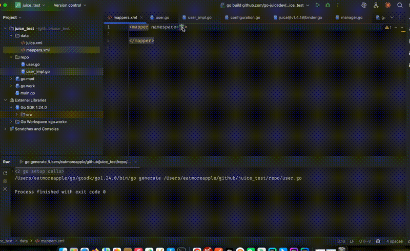

GoLand Plugin
=============

Introduction
------------

The Juice GoLand plugin is an IDE tool built specifically for the Juice framework. It improves development efficiency by providing smart navigation, auto-completion, syntax awareness, and related editor support across XML configuration and Go code.

Preview
-------

Installation
------------

There are two ways to install the Juice GoLand plugin:

1. Install from the IDE marketplace

   - Open GoLand.
   - Go to `Settings/Preferences -> Plugins`.
   - Switch to the `Marketplace` tab.
   - Search for ``Juice``.
   - Click ``Install``.

2. Install manually

   - Download the latest plugin package from the GitHub Releases page.
   - Open GoLand.
   - Go to `Settings/Preferences -> Plugins`.
   - Click the gear icon and choose ``Install Plugin from Disk``.
   - Select the downloaded plugin archive.

Main Features
-------------

1. Smart navigation

   - Jump from XML to the corresponding Go interface definition by Ctrl/Cmd-clicking the interface reference.
   - Jump back from Go interfaces to XML with ``Alt + B`` or the context menu.

2. Auto-completion

   - Namespace auto-completion in XML
   - Method completion for interface methods
   - Parameter name completion

3. Syntax highlighting

   - SQL highlighting inside XML
   - Highlighting for tags and attributes
   - Error indication for invalid syntax

4. Inspections

   - XML configuration syntax checks
   - Interface signature matching checks
   - Namespace validation

Usage Examples
--------------

1. Jump from XML to a Go interface:

.. code-block:: xml

    <mapper namespace="github.com.example.repo.UserMapper">
        <!-- Ctrl/Cmd-click the namespace to jump to UserMapper -->
    </mapper>

2. Namespace auto-completion:

.. code-block:: xml

    <mapper namespace="github.com.example.repo.UserM">
        <!-- The IDE suggests matching namespaces while typing -->
    </mapper>

3. SQL syntax highlighting:

.. code-block:: xml

    <select id="GetUserById">
        SELECT * FROM users WHERE id = #{id}
    </select>

Shortcuts
---------

- ``Ctrl/Cmd + Click``: go to definition
- ``Alt + B``: find usages or navigate to related definitions
- ``Ctrl/Cmd + Space``: trigger auto-completion
- ``Alt + Enter``: show intentions and quick fixes

Common Issues
-------------

1. The plugin cannot be installed

   - Make sure your GoLand version is supported, typically 2023.1 or later.
   - Check network connectivity.
   - Try manual installation.

2. Navigation does not work

   - Make sure the project is configured correctly.
   - Check that the namespace in the XML file is correct.
   - Make sure the Go interface file is available and indexed.

3. Auto-completion does not work

   - Check that code completion is enabled.
   - Make sure indexing has finished.
   - Try rebuilding the IDE index.

Feedback and Support
--------------------

If you run into issues or have suggestions for improvement, you can provide feedback through:

- a GitHub issue on the project repository
- the official documentation feedback channel
- the support email address
